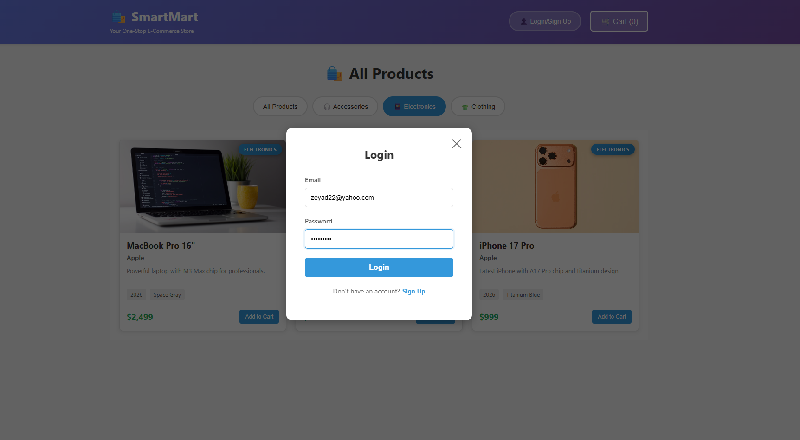
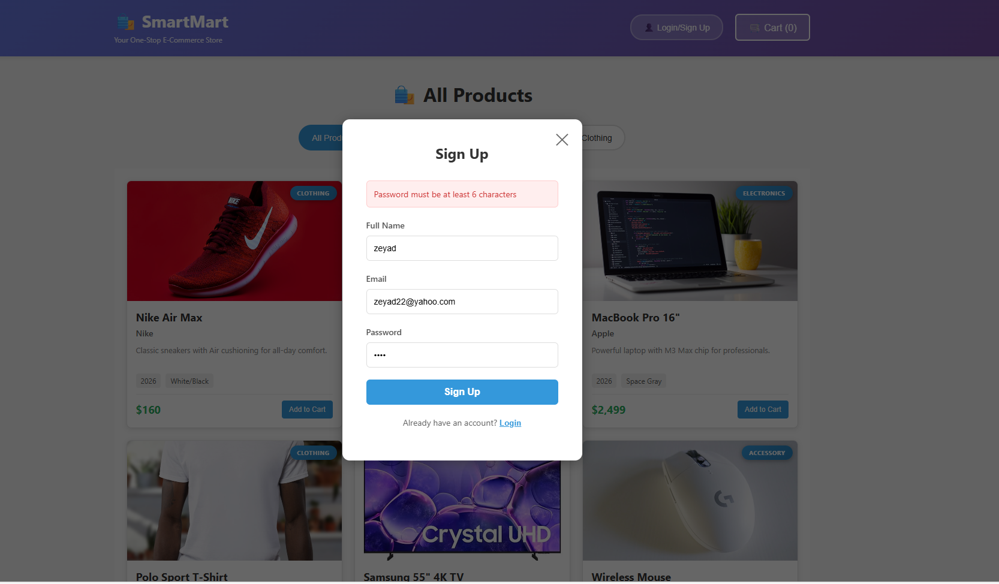
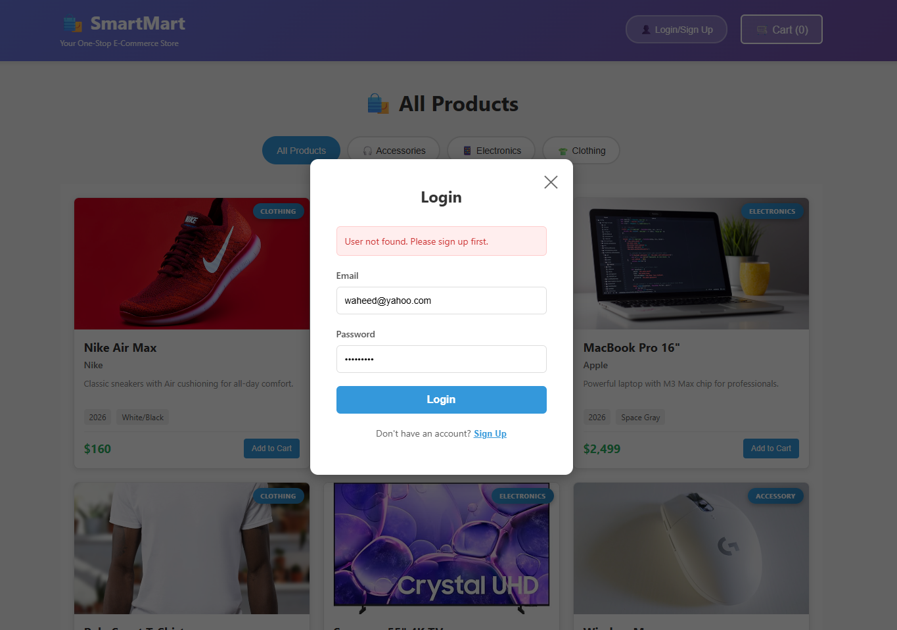
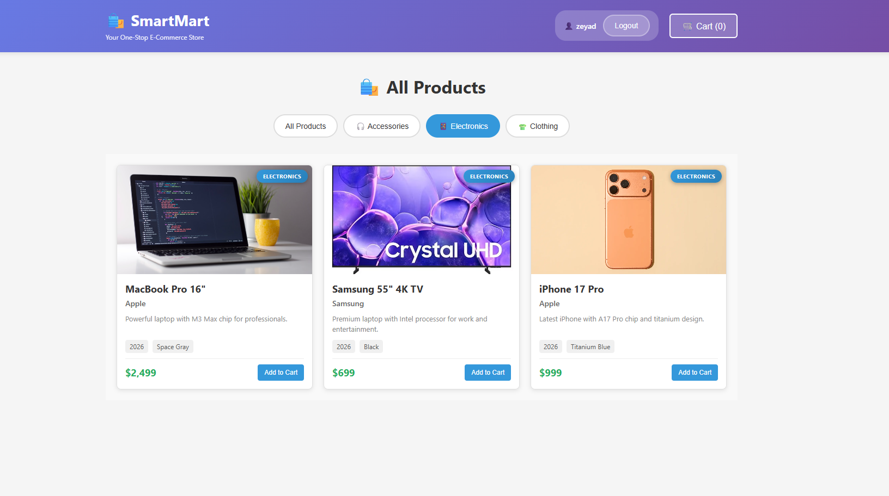
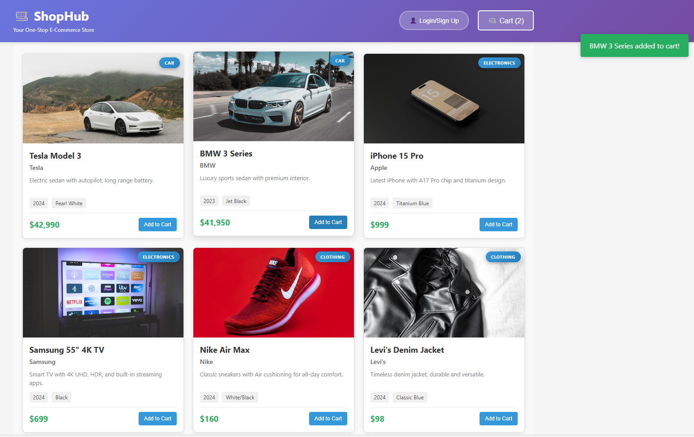
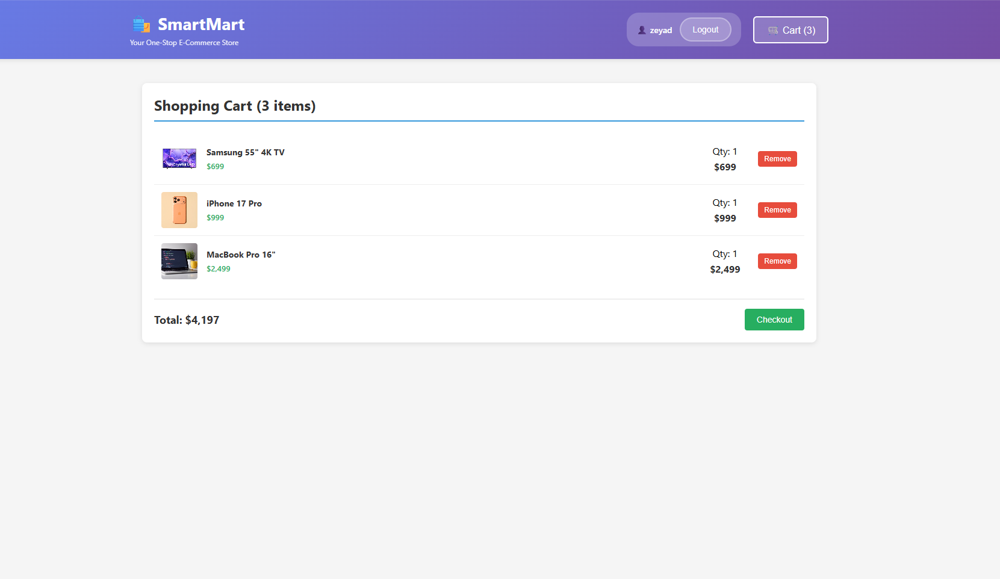
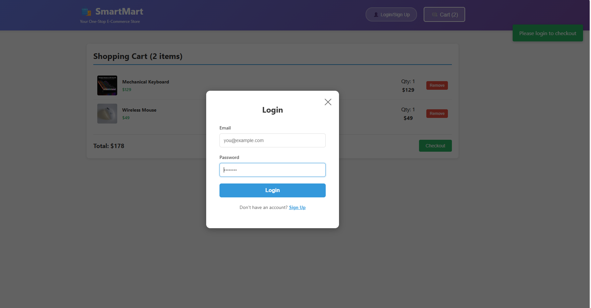
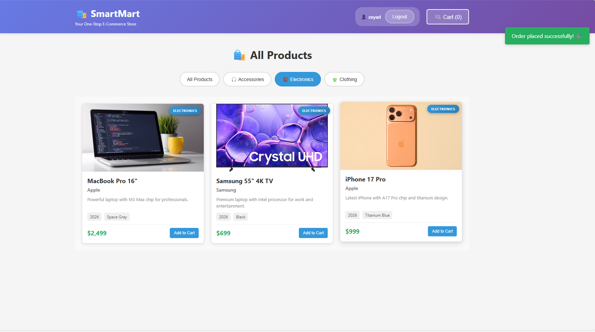
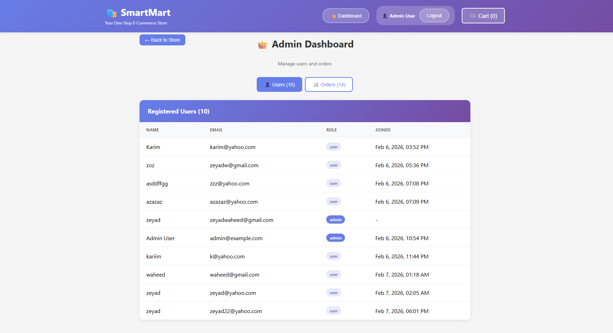
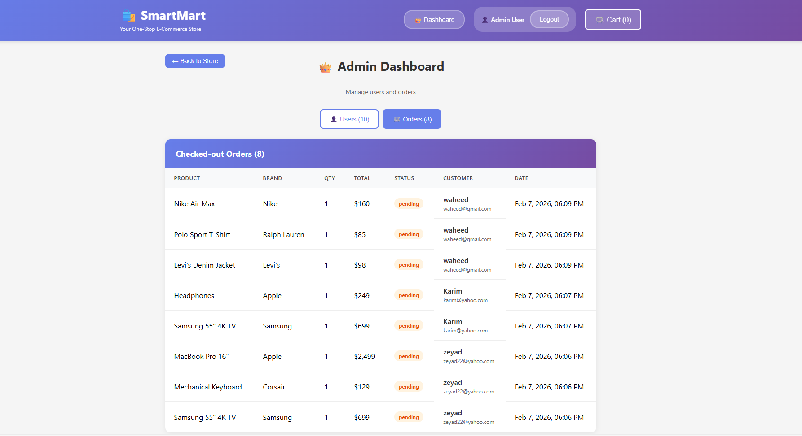

# SmartMart — Full-Stack E-Commerce Application

A full-stack e-commerce platform with user authentication, admin dashboard, accessory catalog, and order management. Built with Node.js(ES6), Express, MongoDB, and React.

---

## Tech Stack

| Layer | Technologies |
|-------|--------------|
| **Frontend** | React 18, Axios, CSS3 |
| **Backend** | Node.js (ESM), Express.js |
| **Database** | MongoDB with Mongoose |
| **Auth** | JWT, bcrypt |
| **Validation** | Joi |

---
## Architecture & Design

- **Design Pattern:** MVC (Model-View-Controller)  
  The backend follows MVC principles:  
  - **Models** handle database schemas and operations (Mongoose models)  
  - **Views** are handled in React components (frontend)  
  - **Controllers** manage business logic and route handling

- **Modern JavaScript:**  
  - ES6+ syntax (import/export modules, arrow functions, async/await, template literals)  
  - Fully modular structure for maintainability

  ---
## Features

### Customer
- Browse accessories (Phone Accessories, Chargers, Cases)
- Filter by category
- Add items to cart
- Sign up / Login
- Checkout and place orders

### Admin
- Admin dashboard with restricted access
- View all registered users
- View all checked-out orders with customer details
- User and order management

### API
- RESTful endpoints
- JWT authentication
- Role-based access (admin / user)
- CORS enabled

---

## Project Overview

## Project Overview

**SmartMart** is a full-stack, purpose-built e-commerce application for accessories, electronics, and clothing. Built with modern JavaScript (ES6+), Node.js, Express, MongoDB, and React, the project follows a **modular MVC architecture**, ensuring scalability, maintainability, and clear separation of concerns.

- **Accessories-first catalog:** Provides dedicated endpoints and UI components for browsing and managing accessory products alongside electronics and clothing.
- **Seeded demo data:** Includes sample products for easy local testing and demonstration.
- **RESTful API design:** All product and accessory endpoints (e.g., `/api/products`, `/api/accessories`) follow RESTful conventions with clean separation between models, controllers, and routes.


---

### Authentication & Authorization

- Passwords are hashed using `bcrypt`.
- JWT is issued on login and sent in the `Authorization` header.
- Protected routes validate JWT.
- Admin routes require `admin` role; users cannot access.

---


## Project Structure

```
ecommerce/
├── client/                          # React frontend
│   ├── public/
│   │   ├── favicon.svg              # App icon
│   │   ├── index.html
│   │   └── images/                  # Product images
│   └── src/
│       ├── components/
│       │   ├── AdminDashboard.js    # Admin: users & orders
│       │   ├── AuthForm.js
│       │   ├── Cart.js
│       │   ├── Header.js
│       │   ├── ProductCard.js
│       │   ├── ProductList.js
│       │   └── ...
│       ├── services/
│       │   ├── api.js               # Product & order API
│       │   └── authAPI.js           # Auth & admin API
│       ├── App.js
│       └── index.js
│
├── server/                          # Node.js backend
│   ├── script/
│   │   ├── adminSeed.js             # Seed admin user
│   │   └── productSeed.js           # Seed products
│   └── src/
│       ├── database/
│       │   ├── connection.js        # Product & Order ops
│       │   ├── userConnection.js    # User ops
│       │   ├── mongoConnection.js   # MongoDB connect
│       │   └── models/
│       │       ├── User.js
│       │       ├── Product.js
│       │       └── Order.js
│       ├── middleware/
│       │   ├── auth.js              # JWT, requireAdmin
│       │   ├── errorHandler.js
│       │   └── validation.js
│       ├── modules/
│       │   ├── products/            # Products & orders
│       │   ├── users/               # Auth & admin
│       │   └── accessories/
│       ├── utils/
│       └── index.js
│
└── README.md
```

---

## Screenshots

### Customer Pages
---
**Login Page**  
---

---
**Sign Up Page**  
---


---
**Sign Up Validation Page (Email & Password)** 
---


---
**Login Validation Page (Email & Password)**  
---


---
**Products Page**  
---

---
**Categorized Products**  
---


---
**Add to Cart**  
---

---
**Cart Overview**
---

---
**Checkout Attempt Without Login**  
---

---
**Order Checkout Successful**  
---

---
### Admin Pages

**Users Dashboard**  
---

---
**Orders Dashboard**  
---

---

## Getting Started

### Prerequisites

- Node.js 18+
- MongoDB (local or Atlas)

### 1. Clone and install

```bash
git clone https://github.com/YOUR_USERNAME/smartmart.git
cd smartmart
```

### 2. Backend setup

```bash
cd server
npm install
```

Create `.env` in the `server` folder:

```env
PORT=5000
NODE_ENV=development
FRONTEND_URL=http://localhost:3000
SECRET_KEY=your-jwt-secret-key-here
MONGODB_URI=mongodb://localhost:27017/ecommerce
```

Start the server:

```bash
npm start
# or: npm run dev   (with auto-reload)
```

Server runs at `http://localhost:5000`

### 3. Seed data (optional)

```bash
cd server
npm run seed:admin      # Creates admin: admin@example.com / 123456
npm run seed:products   # Creates sample products
```

### 4. Frontend setup

```bash
cd client
npm install
npm start
```

Frontend runs at `http://localhost:3000`

---

## API Endpoints

### Auth (`/api/auth`)

| Method | Endpoint | Auth | Description |
|--------|----------|------|-------------|
| POST | `/signup` | — | Register user |
| POST | `/login` | — | Login |
| GET | `/me` | Yes | Current user |
| GET | `/users` | Admin | All users |
| GET | `/orders` | Admin | All orders |

### Products (`/api/products`)

| Method | Endpoint | Auth | Description |
|--------|----------|------|-------------|
| GET | `/` | — | All products |
| GET | `/:id` | — | Product by ID |
| POST | `/` | Yes | Create product |
| PUT | `/:id` | Yes | Update product |
| DELETE | `/:id` | Yes | Delete product |
| POST | `/orders` | Yes | Create order |
| GET | `/orders` | Yes | User orders |

---

## Environment Variables

| Variable | Description |
|----------|-------------|
| `PORT` | Server port (default: 5000) |
| `NODE_ENV` | `development` / `production` |
| `FRONTEND_URL` | Allowed CORS origin |
| `SECRET_KEY` | JWT signing secret |
| `MONGODB_URI` | MongoDB connection string |
| `BCRYPT_SALT_ROUNDS` | Cost factor for bcrypt password hashing |


---

## Deployment

### GitHub

1. Create a new repository on GitHub.
2. Add a `.gitignore` (if missing) with:
   ```
   node_modules/
   .env
   client/build/
   ```
3. Initialize git (if not done):
   ```bash
   git init
   git add .
   git commit -m "Initial commit: SmartMart e-commerce"
   ```
4. Add remote and push:
   ```bash
   git remote add origin https://github.com/YOUR_USERNAME/smartmart.git
   git branch -M main
   git push -u origin main
   ```

### Frontend build

```bash
cd client
npm run build
```

Serve the `build` folder via any static host (Vercel, Netlify, etc.).

### Production backend

- Set `NODE_ENV=production`
- Use MongoDB Atlas for database
- Set `FRONTEND_URL` to your deployed frontend URL
- Use a strong `SECRET_KEY`

---

## Future Improvements

- **Wishlist / Favorites** – Allow users to save products for later.  
- **Payment Gateway Integration** – Stripe, PayPal, etc.  
- **Product Reviews & Ratings** – Customer feedback system.  
- **Mobile Optimization / PWA** – Fully responsive, installable app.

---


## Author

**Zeyad Waheed Fahmy, Backend - Full Stack Developer / TA**

[](https://www.linkedin.com/in/zeyad-waheed-871725269)
